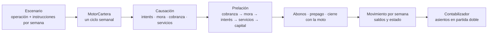
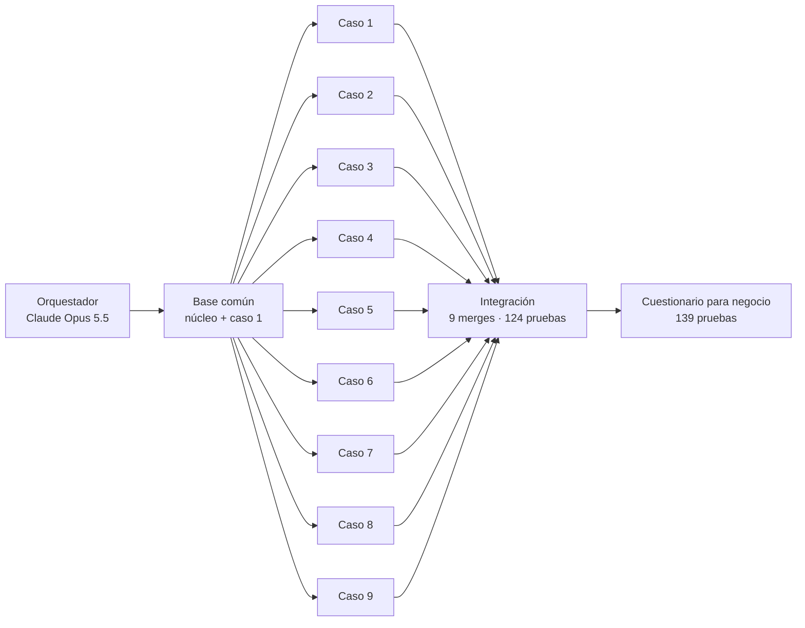

# Fintech · Motor de reglas de cartera de motos

Respaldo del trabajo de **Juan Esteban Cardozo** para la plataforma de crédito de motos (proyecto Financiera, con Heider Galvis y Diego González). Contiene el **motor de reglas de cartera** que reproduce el Excel de casos operativos de Diego, un **cuestionario** para que negocio defina las reglas abiertas, el **backlog** del proyecto y la documentación de **cómo se construyó con agentes de IA**.

> Construido con **Claude Code** y el modelo **Claude Opus 5.5** (`claude-opus-5-5`) de Anthropic: una sesión orquestadora y 9 agentes en paralelo. Detalle en [docs/agentes/](docs/agentes/README.md).

## Qué hay aquí

| Carpeta | Qué es |
|---|---|
| [`src/`](src/) | Motor de reglas (Java 21 + Spring Boot 4 + Spring Modulith, monolito modular) |
| [`cuestionario/`](cuestionario/) | Front (React + Vite + Tailwind con el diseño de Prestaya) para que Diego responda las reglas viendo el efecto de cada opción; exporta a Excel |
| [`herramientas/`](herramientas/) | Exportador del Excel a CSV de prueba e importador de las respuestas del cuestionario |
| [`docs/`](docs/) | Decisiones, ADR, reglas por caso, preguntas para Diego, pendientes y documentación de los agentes |
| [`docs/diagrama/`](docs/diagrama/agentes-motor-cartera.html) | Diagrama interactivo de cómo operaron los 9 agentes |
| [`backlog-financiera/`](backlog-financiera/) | Épicas, features e historias (Gherkin) del proyecto en Azure DevOps, priorización por sprints en LaTeX |
| [`docs/fuentes/`](docs/fuentes/) | Excel de casos operativos de Diego (fuente de verdad de las reglas) |

## Estado

- **Los 9 casos del Excel se reproducen celda por celda** (tolerancia 1 COP): operación normal, cambio de tasa, dación en pago, retoma, prepago total, abono extra (menor plazo y menor cuota), pago inferior con mora y pago tardío con cobranza.
- **139 pruebas automáticas, 0 fallas**, incluidas las 33 validaciones de la hoja Validaciones y reglas que nunca se pueden romper (saldo nunca negativo, asientos siempre cuadrados).
- **Asientos contables** de cada evento en partida doble (recaudo, abonos, pago inferior con reclasificación, cobranza y mora, dación, retoma).
- **Cuota inicial = 10 % del valor total de la operación** (decisión de Juan Esteban).
- **Reglas configurables** (`ReglasNegocio`) para lo que negocio aún no define; por defecto reproducen el Excel.

## Cómo funciona el motor



Cada caso del Excel es un `Escenario` con instrucciones por semana (pago completo, parcial, tardío, sin pago, abono, prepago, cambio de tasa, dación/retoma). Un solo ciclo los cubre todos.

## Cómo se construyó: orquestador + 9 agentes



| | |
|---|---|
| **LLM** | Claude Opus 5.5 (`claude-opus-5-5`), orquestador y los 9 agentes (los agentes heredan el modelo de la sesión) |
| **Herramienta** | Claude Code, herramienta `Agent`, tipo `general-purpose` |
| **Aislamiento** | Un `git worktree` por agente, con su rama |
| **Ejecución** | En paralelo y en segundo plano: 7 min 14 s en total, 1.032.778 tokens, 237 llamadas a herramientas |
| **Resultado** | 9 de 9 casos al centavo, 122 pruebas de los agentes, 1 solo cambio al motor compartido |

Prompts, métricas por agente, reglas para que no se pisaran y cómo repetir el método: [docs/agentes/README.md](docs/agentes/README.md). Diagrama interactivo: abrir [`docs/diagrama/agentes-motor-cartera.html`](docs/diagrama/agentes-motor-cartera.html) en el navegador.

## Comandos

```bash
# Motor (JDK 21)
export JAVA_HOME="/c/Program Files/Microsoft/jdk-21.0.10.7-hotspot"
./mvnw -q -B test                              # 139 pruebas
python herramientas/exportar_excel.py          # regenera los CSV desde el Excel

# Cuestionario
cd cuestionario && npm install
npm run escenarios   # cifras de cada opción calculadas por el motor
npm test && npm run build   # dist/index.html: un solo archivo para enviar a Diego

# Respuestas de Diego → motor
python herramientas/importar_respuestas.py <excel-de-respuestas>.xlsx
./mvnw -q -B test    # ReglasNegocioConfiguradaTest corre los casos con sus reglas
```

## Documentos clave

- [Decisiones](docs/decisiones.md) y [ADR del monolito modular](docs/adr/0001-monolito-modular.md)
- [Preguntas para Diego](docs/preguntas-diego.md) (consolidado de los 9 casos)
- Reglas por caso: [`docs/reglas/caso-1.md`](docs/reglas/caso-1.md) a [`caso-9.md`](docs/reglas/caso-9.md)
- [Pendientes técnicos](docs/pendientes-tecnicos.md)
- [Backlog y priorización](backlog-financiera/) (`priorizacion_hu.tex` se abre en Overleaf)

## Origen

- Parte del proyecto Prestaya (front de asesores de concesionario): el cuestionario reutiliza su diseño (tokens de color y tipografía). Repo original: `JuanDavidGarciaGarcia/Fintech`.
- Reglas: Excel *Casos Operaciones V2 mejorado* de Diego González.
- Referencia de arquitectura revisada: [Apache Fineract](https://github.com/apache/fineract) (se usó como referencia de diseño; ver el ADR para por qué no como núcleo).
