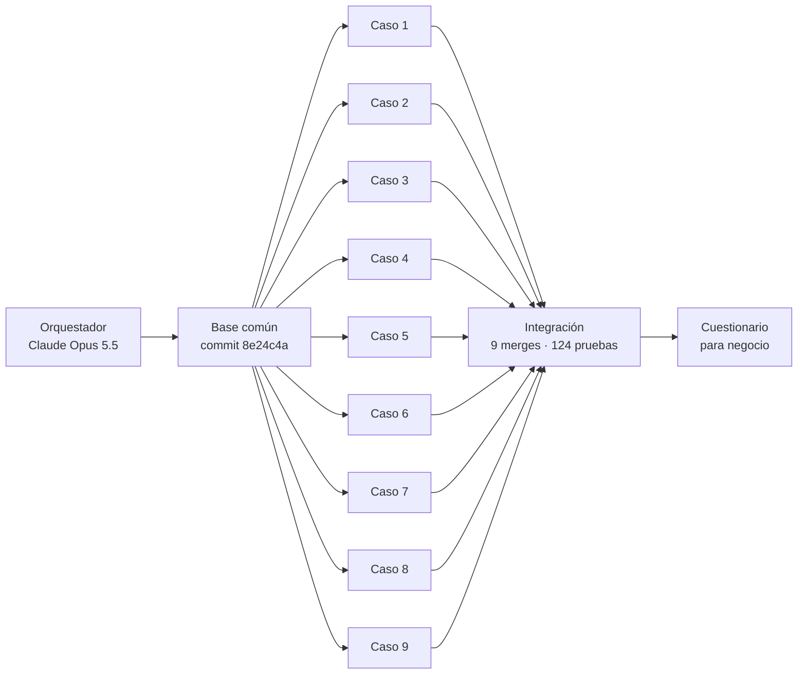

# Cómo se construyó el motor con agentes de IA

El 8 de octubre de 2026 el motor se construyó con **una sesión principal (orquestador) y 9 agentes en paralelo**, uno por caso del Excel de Diego. Diagrama interactivo: [`docs/diagrama/agentes-motor-cartera.html`](../diagrama/agentes-motor-cartera.html) (ábralo en el navegador).

## Modelo y herramienta

| Pieza | Valor |
|---|---|
| Modelo de lenguaje (LLM) | **Claude Opus 5.5** (`claude-opus-5-5`), de Anthropic |
| Quién lo usó | El orquestador y los 9 agentes. Al lanzar los agentes no se fijó otro modelo, así que heredaron el de la sesión principal. |
| Herramienta | **Claude Code** (extensión de VS Code), herramienta `Agent` |
| Tipo de agente | `general-purpose`: puede leer, buscar, editar archivos y correr comandos (Bash, Maven, Python) |
| Aislamiento | `isolation: worktree`: cada agente recibió una copia del repo (`git worktree`) en `.claude/worktrees/agent-…`, con su rama propia creada desde el commit base |
| Ejecución | `run_in_background: true`: los 9 al mismo tiempo; cada uno avisó al terminar con su reporte |

## Las 4 fases



1. **Base común (orquestador).** Antes de lanzar agentes se construyó lo que todos comparten, para que no salieran 9 motores distintos: proyecto Java 21 + Spring Boot 4 + Spring Modulith, exportador del Excel a CSV, núcleo (`ParametrosProducto`, `Tasas`, `Calendario`, `Amortizacion`, `Servicios`), un solo ciclo semanal (`MotorCartera`), base contable y el caso 1 reproducido celda por celda. `CLAUDE.md` con las reglas de trabajo en paralelo. Commit `8e24c4a`.
2. **9 agentes en paralelo.** Cada uno: prueba celda por celda de su hoja, validaciones de la hoja Validaciones, regla contable si aplica, documento de reglas y preguntas, commit en su rama y reporte.
3. **Integración (orquestador).** Merge de las 9 ramas en orden; los únicos choques (4) fueron en el registro de reglas de `Contabilizador` y se resolvieron uniendo líneas. Se verificó que ningún pago se contabilizara dos veces y se corrigió el ruido decimal (1e-27) que reportaron tres agentes. Suite: **124 pruebas, 0 fallas** (commit `e815f82`).
4. **Cuestionario (orquestador).** Las preguntas de los agentes se volvieron opciones configurables (`ReglasNegocio`), un cuestionario para Diego con cifras del motor y un importador de sus respuestas. Suite: **139 pruebas, 0 fallas** (commit `73756ea`).

## Los 9 agentes

| # | Caso | Duración | Tokens | Herramientas | Pruebas | Commit | Hallazgo principal |
|---|---|---|---|---|---|---|---|
| 1 | Normal + transversales | 7 min 14 s | 159.236 | 34 | 25 | `a12318c` | Con inicial del 10 % la cuota baja a 99.913,34; el límite de 120 semanas no sirve para plazos > 27 meses |
| 2 | Cambio de tasa | 4 min 40 s | 108.618 | 24 | 17 | `4a7a55d` | Nueva cuota 109.308,38; regla de usura implementada (no está en el Excel) |
| 3 | Dación en pago | 5 min 23 s | 112.609 | 32 | 9 | `ec217cf` | No se causa mora ni servicios antes de la dación (los casos 8 y 9 sí) |
| 4 | Retoma | 4 min 7 s | 102.371 | 19 | 7 | `a68b27e` | Dación y retoma tienen las mismas fórmulas; solo cambia el signo del residuo |
| 5 | Prepago total | 4 min 26 s | 106.138 | 25 | 13 | `30efd7a` | Asiento de abonos reutilizable para los casos 5, 6 y 7 |
| 6 | Abono · menor plazo | 4 min 20 s | 102.964 | 21 | 12 | `6df09b3` | Termina en la semana 61; detectó ruido decimal en el núcleo |
| 7 | Abono · menor cuota | 5 min 7 s | 113.038 | 29 | 14 | `af8dbaf` | Nueva cuota 51.032,32; el Excel usa la tasa original aunque haya cambiado |
| 8 | Pago inferior y mora | 6 min 22 s | 118.234 | 30 | 12 | `1962b47` | El vencido paga interés corriente y mora (posible doble cobro) |
| 9 | Pago tardío y cobranza | 5 min 1 s | 109.570 | 23 | 13 | `8fefa8d` | Con 14 días de atraso el crédito nunca termina (18,74 M pagados, 3,32 M pendientes) |
| | **Total** | **7 min 14 s** (en paralelo) | **1.032.778** | **237** | **122** | | |

Las 122 pruebas de los agentes más `ModularidadTest` y la prueba de arranque dan las 124 de la integración.

## Cómo se armó cada prompt

Cada prompt = **plantilla común** + **sección del caso**. Están en [`prompts/`](prompts/):

- [`plantilla-comun.md`](prompts/plantilla-comun.md): lo que recibieron los 9.
- [`casos.md`](prompts/casos.md): la parte específica de cada agente (reglas del Excel con cifras esperadas y entregables).

Reglas clave para que 9 agentes no se pisaran:

1. **Dueño por archivo:** cada agente solo crea `casos/CasoN*Test.java`, `docs/reglas/caso-N.md` y su regla contable.
2. **Motor compartido con cambios mínimos:** `MotorCartera.java` solo se toca si es indispensable, comentado y con toda la suite en verde. Resultado: 8 de 9 agentes no lo tocaron; el caso 7 hizo un ajuste de presentación.
3. **Registro con una línea:** cada regla contable se registra con una sola línea en `Contabilizador.estandar()`, con nombre completo de clase para no chocar en los imports.
4. **Fronteras contables explícitas:** los agentes de los casos 1, 8 y 9 documentaron qué regla contabiliza qué semana y dejaron pruebas que fallan si la caja se debita dos veces.
5. **El Excel es la ley:** si el Excel es inconsistente, se reproduce tal cual y se anota como pregunta para Diego; nada se "corrige" en silencio.
6. **Commits sin atribución** a la IA, a nombre de Juan Esteban.

## Reproducir el método

Desde Claude Code, con el repo base en un commit limpio:

```text
Agent(
  description = "Caso N <nombre>",
  subagent_type = "general-purpose",   # por defecto
  isolation = "worktree",
  run_in_background = true,
  prompt = plantilla-comun.md + sección del caso en casos.md
)
```

Al terminar todos: `git merge --no-ff worktree-agent-<id>` por cada rama, resolver choques, `./mvnw -q -B test`.
